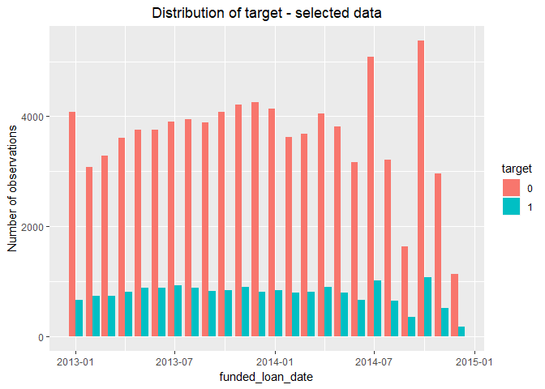
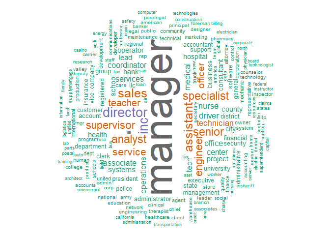
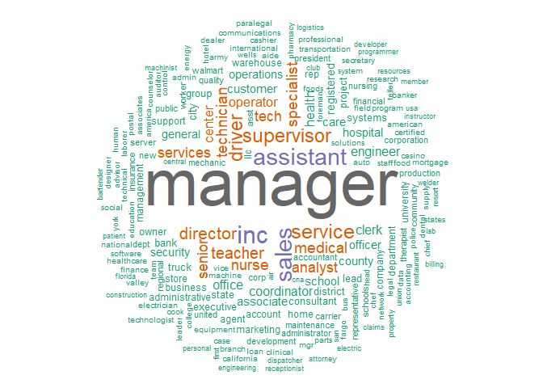
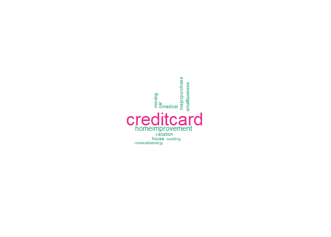

*Let's get more information about the borrowers*
------------------------------------------------

 

### **Word cloud of types of job titles**

To create Word Clouds is needed load these packages:

-   *tm*,
-   *wordcloud*,
-   *RColorBrewer*,

 

From data LC (from 2013-01-01 to 2015-01-01) selected samples of
variable `empl_title`. Created two samples of the dataset:

-   the sample of borrowers who didn't pay off loan,
-   the sample of borrowers who paid off.

This dataset applies to customers who took out a loan for 36 months. A
stable number of target was selected in dataset (from 2013-01 to
2015-01).  These chart represents how the number of bad customers has
changed over time.   

The some examples of employment title from the dataset:  

    ##  [1] "sales man"                        "Claims Admin"                    
    ##  [3] "Inside Sales"                     "Teacher"                         
    ##  [5] "Principal"                        "city manager"                    
    ##  [7] "Team Leader, Manager"             "Teacher"                         
    ##  [9] "bartender"                        "Credit Review Analyst"           
    ## [11] "manager"                          "Manager"                         
    ## [13] "Emergency Physician Assistant"    "EVS supervisor"                  
    ## [15] "Team Lead"                        "laborer"                         
    ## [17] "SR SALES/SVC REP"                 "Child Care Facilities Specialist"
    ## [19] "dispatcher"                       "1st Assistant Golf Professional"

### **Converting the text file into a Corpus**

It is needed to load the data as a
[corpus](https://www.rdocumentation.org/packages/tm/versions/0.7-7/topics/Corpus).

    docsBorrowersDefault        <- Corpus(VectorSource(borrowersWithDefault))
    docsBorrowersWithoutDefault <- Corpus(VectorSource(borrowersWithoutDefault))
    docspurposesBorrowers       <- Corpus(VectorSource(purposesBorrowers))

### **Text cleaning**

Used function `tm_map()` from the `tm` package for processing text (some
operations on the text):

-   strip unnecessary white space,

-   convert everything to lower case,

-   remove numbers and punctuation with the removeNumbers and
    removePunctuation arguments.

<!-- -->

    docsBorrowersDefault_tm <- tm_map(docsBorrowersDefault, stripWhitespace)
    docsBorrowersDefault_tm <- tm_map(docsBorrowersDefault_tm, tolower)
    docsBorrowersDefault_tm <- tm_map(docsBorrowersDefault_tm, removeNumbers)
    docsBorrowersDefault_tm <- tm_map(docsBorrowersDefault_tm, removePunctuation)
    docsBorrowersDefault_tm <- tm_map(docsBorrowersDefault_tm, removeWords, stopwords('english'))

    docsBorrowersWithoutDefault_tm <- tm_map(docsBorrowersWithoutDefault, stripWhitespace)
    docsBorrowersWithoutDefault_tm <- tm_map(docsBorrowersWithoutDefault_tm, tolower)
    docsBorrowersWithoutDefault_tm <- tm_map(docsBorrowersWithoutDefault_tm, removeNumbers)
    docsBorrowersWithoutDefault_tm <- tm_map(docsBorrowersWithoutDefault_tm, removePunctuation)
    docsBorrowersWithoutDefault_tm <- tm_map(docsBorrowersWithoutDefault_tm, removeWords, stopwords('english'))

    docspurposesBorrowers_tm <- tm_map(docspurposesBorrowers, stripWhitespace)
    docspurposesBorrowers_tm <- tm_map(docspurposesBorrowers_tm, tolower)
    docspurposesBorrowers_tm <- tm_map(docspurposesBorrowers_tm, removeNumbers)
    docspurposesBorrowers_tm <- tm_map(docspurposesBorrowers_tm, removePunctuation)
    docspurposesBorrowers_tm <- tm_map(docspurposesBorrowers_tm, removeWords, stopwords('english'))

### **Creating word clouds**

 

#### Word cloud of types of job titles (borrowers who paid off)

    wordcloud (docsBorrowersWithoutDefault_tm,
               scale=c(5,0.5),
               max.words=200,
               random.order=FALSE, rot.per=0.35, use.r.layout=FALSE, colors=brewer.pal(8, 'Dark2'))

 

#### Word cloud of types of job titles (borrowers who didn't pay off loan)

    wordcloud (docsBorrowersDefault_tm,
               scale=c(5,0.5),
               max.words=200,
               random.order=FALSE, rot.per=0.35, use.r.layout=FALSE, colors=brewer.pal(8, 'Dark2'))

   

#### Word cloud of credit purpose

    wordcloud(docspurposesBorrowers_tm,
               scale=c(5,0.5),
               max.words=200,
               random.order=FALSE, rot.per=0.35, use.r.layout=FALSE, colors=brewer.pal(8, 'Dark2'))

**Conclusions**
---------------

Using in R programming package *tm* and the word cloud generator package
*wordcloud* help us to analyze texts and to quickly visualize the
keywords as a word cloud. Word clouds add simplicity for reporting
qualitative data. This is a really good communication tool - easy to
understand.
